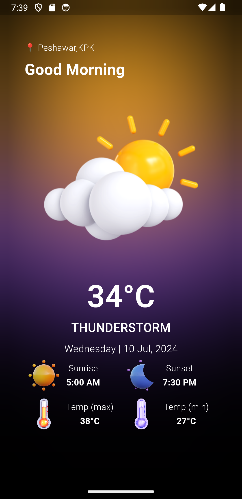

# Weather App

A Flutter application to get real-time weather information for any city. This app uses the OpenWeatherMap API to fetch the current weather data.

## Features

- Fetches current weather information.
- Displays temperature, humidity, and weather conditions.
- Simple and clean user interface.
- Ability to search for weather data by city name.
- Responsive design compatible with both Android and iOS.

## Screenshots



## Figma Prototype


## Getting Started

### Prerequisites

- [Flutter](https://flutter.dev/) installed on your machine.
- An API key from [OpenWeatherMap](https://openweathermap.org/).

### Packages used

- 
- 
- 
- 
- 
- 
- 
- 

### Installation

1. Clone the repository:
   ```bash
   git clone https://github.com/usman619/weather_app.git
   cd weather_app
2. Install the dependencies:
    ```bash
    flutter pub get
3. Run using the following command:
    ```bash
    flutter run
